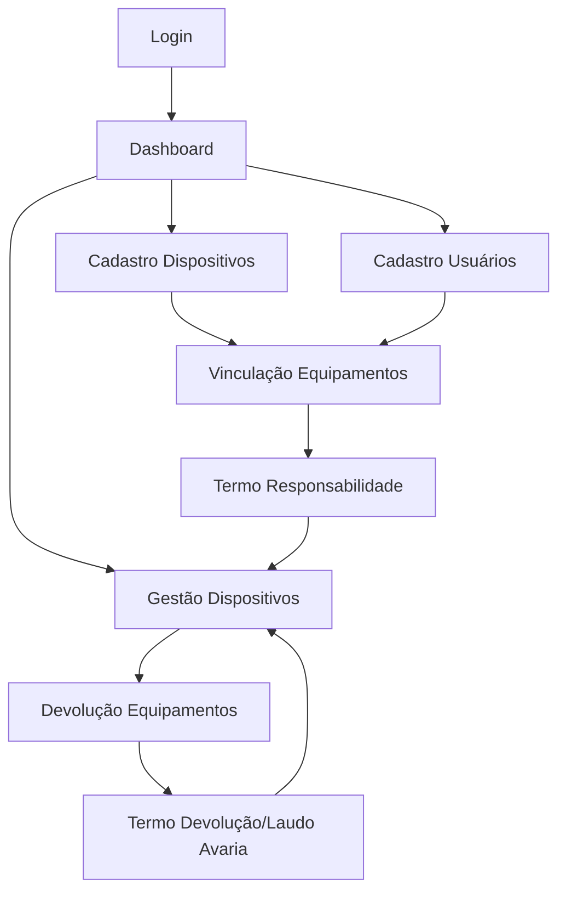

## 1. Product Overview
Sistema web responsivo para controle de entrada e saída de equipamentos de TI da empresa Solução Equipamentos, com foco em rastreabilidade, responsabilidade do colaborador e gestão visual dos ativos.

O produto resolve o problema de gestão desorganizada de equipamentos corporativos, permitindo controle total sobre o ciclo de vida dos dispositivos desde o cadastro até a devolução, com responsabilidade legal clara dos funcionários.

## 2. Core Features

### 2.1 User Roles
| Role | Registration Method | Core Permissions |
|------|---------------------|------------------|
| Admin | Internal registration by system | Full system access - can create, edit, delete all records |
| Operador | Admin creation | Can create and edit records, cannot delete |
| Operador Master | Admin creation | Can create, edit and delete any information |

### 2.2 Feature Module
Nosso sistema de gestão de equipamentos consiste nas seguintes páginas principais:
1. **Login**: autenticação segura, recuperação de senha por e-mail
2. **Dashboard**: visão geral dos equipamentos com gráficos e métricas
3. **Cadastro de Dispositivos**: formulário completo para novos equipamentos
4. **Cadastro de Usuários**: registro de funcionários com dados corporativos
5. **Vinculação de Equipamentos**: associação de dispositivos a usuários com geração de termo
6. **Gestão de Dispositivos**: tabela com filtros e status visuais dos equipamentos
7. **Devolução de Equipamentos**: checklist de vistoria com geração de termos

### 2.3 Page Details
| Page Name | Module Name | Feature description |
|-----------|-------------|---------------------|
| Login | Authentication | Realizar login com e-mail e senha, recuperar senha via e-mail, sessão segura com JWT |
| Dashboard | Metrics Widgets | Exibir total de equipamentos, disponíveis, em uso, locados, avariados com cards interativos |
| Dashboard | Charts | Gráfico de pizza por categoria, gráfico de barras por status, atualização em tempo real |
| Cadastro Dispositivos | Device Form | Cadastrar código, nome, tipo, marca, categoria, número de série, patrimônio, origem, estado, NF, observações |
| Cadastro Usuários | User Form | Registrar nome completo, cargo, departamento, CPF, telefone, WhatsApp, e-mail corporativo |
| Vinculação | User Selection | Selecionar usuário cadastrado, visualizar dados completos do funcionário |
| Vinculação | Device Selection | Selecionar um ou mais dispositivos disponíveis, exibir todos os dados dos equipamentos |
| Vinculação | Term Generation | Gerar prévia do termo de responsabilidade jurídico, opções de imprimir ou enviar por e-mail |
| Vinculação | Electronic Acceptance | Registrar aceite eletrônico com data, hora e IP, alterar status para "Em uso", vincular ao usuário |
| Gestão Dispositivos | Device Table | Exibir tabela com código, nome, usuário atual, categoria, estado, status colorido (verde/disponível, amarelo/aguardando, vermelho/em uso) |
| Gestão Dispositivos | Filters | Filtrar por categoria, usuário, status, origem (locado/próprio) |
| Devolução | User Selection | Selecionar usuário e equipamento para devolução |
| Devolução | Inspection Checklist | Checklist de vistoria com itens como tela, carcaça, teclado, bateria, acessórios |
| Devolução | Term Generation | Gerar termo de devolução para equipamentos OK, gerar laudo de avaria para danificados |
| Devolução | Notifications | Enviar termos automaticamente por e-mail para operador, funcionário e RH quando necessário |

## 3. Core Process
### Admin Flow
1. Acessa sistema via login seguro
2. Cadastra novos equipamentos com todas as especificações
3. Cadastra funcionários com dados corporativos
4. Realiza vinculação de equipamentos aos usuários
5. Gera termo de responsabilidade e envia por e-mail
6. Monitora equipamentos em uso através do dashboard
7. Processa devoluções com checklist de vistoria
8. Gera laudos de avaria quando necessário

### Operador Flow
1. Realiza login no sistema
2. Cadastra novos equipamentos e usuários
3. Realiza vinculações e devoluções
4. Visualiza dashboard e relatórios
5. Não pode excluir registros

### Operador Master Flow
1. Acesso completo como admin
2. Pode criar, editar e excluir qualquer informação
3. Gerencia todos os processos do sistema

## 4. User Interface Design
### 4.1 Design Style
- **Cores Primárias**: Azul corporativo (#1E40AF), cinza escuro (#374151)
- **Cores Secundárias**: Branco (#FFFFFF), verde status (#10B981), amarelo (#F59E0B), vermelho (#EF4444)
- **Estilo de Botões**: Arredondados com efeito hover sutil, sombra suave
- **Tipografia**: Fonte moderna sans-serif (Inter ou Roboto), tamanhos hierárquicos claros
- **Layout**: Card-based com navegação lateral fixa, ícones grandes e intuitivos
- **Ícones**: Estilo line-icons modernos, consistentes em todo o sistema

### 4.2 Page Design Overview
| Page Name | Module Name | UI Elements |
|-----------|-------------|-------------|
| Login | Card Central | Fundo gradiente escuro, card branco centralizado com logo da empresa, campos de e-mail/senha com ícones, botão azul com hover effect |
| Dashboard | Metrics Cards | Cards grandes no topo com ícones e números destacados, animação de contador ao carregar, cores correspondentes aos status |
| Dashboard | Charts | Gráficos animados com Chart.js, cores consistentes com paleta corporativa, tooltips interativos |
| Gestão | Device Table | Tabela zebra com status coloridos (círculos), cabeçalho fixo, paginação, filtros laterais collapsible |
| Vinculação | Form Sections | Formulário multi-step com indicadores de progresso, seleção múltipla de dispositivos com checkboxes |
| Devolução | Inspection Form | Checklist vertical com switches ou checkboxes, área de observações, preview do termo em modal |

### 4.3 Responsiveness
Desktop-first design com adaptação completa para tablets e smartphones. Layout responsivo com menu hamburger em mobile, tabelas scrollable horizontalmente, formulários em coluna única em telas pequenas, otimização de touch em elementos interativos.

### 4.4 Document Templates
Os termos de responsabilidade e devolução seguem layout estilo documento jurídico com:
- Cabeçalho com logo da empresa
- Texto em fonte serifada tradicional
- Campos automáticos destacados em negrito
- Rodapé com data, IP e hash de validação
- Opção de carimbo eletrônico com QR code de validação