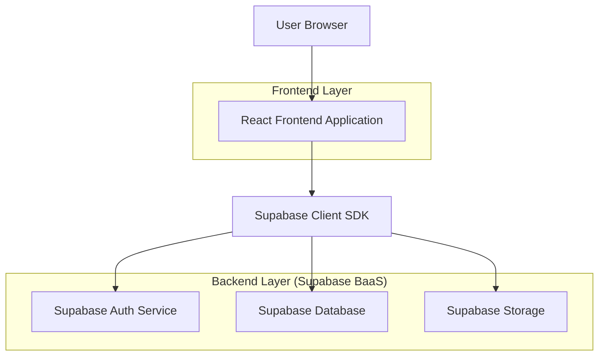
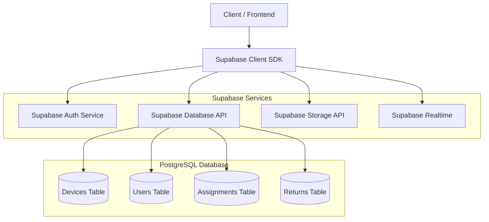
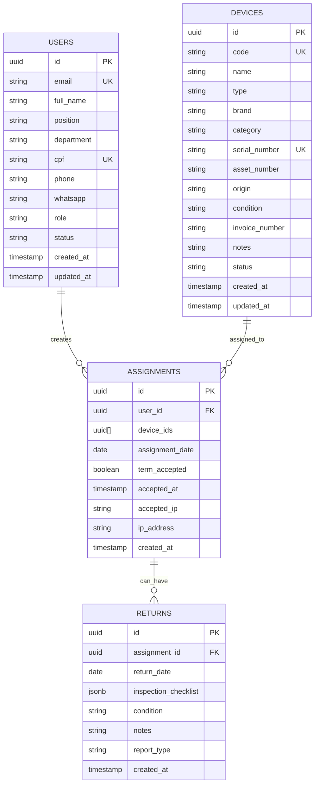

## 1. Architecture design



## 2. Technology Description
- Frontend: React@18 + tailwindcss@3 + vite
- Initialization Tool: vite-init
- Backend: Supabase (BaaS)
- Authentication: Supabase Auth (JWT)
- Database: PostgreSQL (via Supabase)
- Storage: Supabase Storage (for document templates)
- State Management: React Context + useReducer
- UI Components: HeadlessUI + Heroicons
- Charts: Chart.js + react-chartjs-2
- PDF Generation: jspdf + html2canvas

## 3. Route definitions
| Route | Purpose |
|-------|---------|
| /login | Login page, user authentication |
| /dashboard | Main dashboard with metrics and charts |
| /devices | Device management table and CRUD operations |
| /devices/new | New device registration form |
| /devices/edit/:id | Device edit form |
| /users | User management table and CRUD operations |
| /users/new | New user registration form |
| /users/edit/:id | User edit form |
| /assignments | Device assignment to users |
| /assignments/new | New assignment with term generation |
| /returns | Device return process |
| /returns/new | New return with inspection checklist |
| /reports | System reports and exports |

## 4. API definitions

### 4.1 Authentication APIs

**User Login**
```
POST /auth/v1/token?grant_type=password
```

Request:
```json
{
  "email": "user@empresa.com",
  "password": "senha123"
}
```

Response:
```json
{
  "access_token": "eyJhbGc...",
  "token_type": "bearer",
  "expires_in": 3600,
  "refresh_token": "xyz123...",
  "user": {
    "id": "uuid",
    "email": "user@empresa.com",
    "role": "admin"
  }
}
```

**Password Recovery**
```
POST /auth/v1/recover
```

### 4.2 Device Management APIs

**List Devices with Filters**
```
GET /rest/v1/devices?select=*&status=eq.available
```

**Create Device**
```
POST /rest/v1/devices
```

Request:
```json
{
  "code": "NTB-001",
  "name": "Notebook Dell Inspiron",
  "type": "Notebook",
  "brand": "Dell",
  "category": "Computadores",
  "serial_number": "ABC123456",
  "asset_number": "12345",
  "origin": "Próprio",
  "condition": "Novo",
  "invoice_number": "NF-2024-001",
  "notes": "Equipamento novo",
  "status": "available"
}
```

### 4.3 User Management APIs

**Create User**
```
POST /rest/v1/users
```

Request:
```json
{
  "full_name": "João Silva",
  "position": "Analista de TI",
  "department": "Tecnologia",
  "cpf": "123.456.789-00",
  "phone": "(11) 98765-4321",
  "whatsapp": "(11) 98765-4321",
  "email": "joao.silva@empresa.com",
  "status": "active"
}
```

### 4.4 Assignment APIs

**Create Assignment with Term**
```
POST /rest/v1/assignments
```

Request:
```json
{
  "user_id": "uuid",
  "device_ids": ["uuid1", "uuid2"],
  "assignment_date": "2024-01-15",
  "term_accepted": false,
  "ip_address": "192.168.1.1"
}
```

**Accept Term**
```
PATCH /rest/v1/assignments?id=eq.assignment_id
```

Request:
```json
{
  "term_accepted": true,
  "accepted_at": "2024-01-15T10:30:00Z",
  "accepted_ip": "192.168.1.1"
}
```

### 4.5 Return APIs

**Process Return**
```
POST /rest/v1/returns
```

Request:
```json
{
  "assignment_id": "uuid",
  "return_date": "2024-02-01",
  "inspection_checklist": {
    "screen": true,
    "case": true,
    "keyboard": true,
    "battery": true,
    "accessories": true
  },
  "condition": "Bom",
  "notes": "Equipamento em perfeito estado"
}
```

## 5. Server architecture diagram



## 6. Data model

### 6.1 Data model definition



### 6.2 Data Definition Language

**Users Table**
```sql
-- create table
CREATE TABLE users (
    id UUID PRIMARY KEY DEFAULT gen_random_uuid(),
    email VARCHAR(255) UNIQUE NOT NULL,
    full_name VARCHAR(255) NOT NULL,
    position VARCHAR(100),
    department VARCHAR(100),
    cpf VARCHAR(14) UNIQUE NOT NULL,
    phone VARCHAR(20),
    whatsapp VARCHAR(20),
    role VARCHAR(20) DEFAULT 'operator' CHECK (role IN ('admin', 'operator', 'master_operator')),
    status VARCHAR(20) DEFAULT 'active' CHECK (status IN ('active', 'inactive')),
    created_at TIMESTAMP WITH TIME ZONE DEFAULT NOW(),
    updated_at TIMESTAMP WITH TIME ZONE DEFAULT NOW()
);

-- create indexes
CREATE INDEX idx_users_email ON users(email);
CREATE INDEX idx_users_cpf ON users(cpf);
CREATE INDEX idx_users_department ON users(department);
```

**Devices Table**
```sql
-- create table
CREATE TABLE devices (
    id UUID PRIMARY KEY DEFAULT gen_random_uuid(),
    code VARCHAR(50) UNIQUE NOT NULL,
    name VARCHAR(255) NOT NULL,
    type VARCHAR(50) NOT NULL,
    brand VARCHAR(100),
    category VARCHAR(100),
    serial_number VARCHAR(100) UNIQUE NOT NULL,
    asset_number VARCHAR(50),
    origin VARCHAR(20) CHECK (origin IN ('Locado', 'Próprio')),
    condition VARCHAR(20) CHECK (condition IN ('Novo', 'Usado', 'Avariado')),
    invoice_number VARCHAR(50),
    notes TEXT,
    status VARCHAR(20) DEFAULT 'available' CHECK (status IN ('available', 'assigned', 'waiting_acceptance', 'damaged')),
    created_at TIMESTAMP WITH TIME ZONE DEFAULT NOW(),
    updated_at TIMESTAMP WITH TIME ZONE DEFAULT NOW()
);

-- create indexes
CREATE INDEX idx_devices_code ON devices(code);
CREATE INDEX idx_devices_status ON devices(status);
CREATE INDEX idx_devices_type ON devices(type);
CREATE INDEX idx_devices_category ON devices(category);
```

**Assignments Table**
```sql
-- create table
CREATE TABLE assignments (
    id UUID PRIMARY KEY DEFAULT gen_random_uuid(),
    user_id UUID REFERENCES users(id) ON DELETE CASCADE,
    device_ids UUID[] NOT NULL,
    assignment_date DATE NOT NULL,
    term_accepted BOOLEAN DEFAULT FALSE,
    accepted_at TIMESTAMP WITH TIME ZONE,
    accepted_ip INET,
    ip_address INET,
    created_at TIMESTAMP WITH TIME ZONE DEFAULT NOW(),
    updated_at TIMESTAMP WITH TIME ZONE DEFAULT NOW()
);

-- create indexes
CREATE INDEX idx_assignments_user_id ON assignments(user_id);
CREATE INDEX idx_assignments_term_accepted ON assignments(term_accepted);
```

**Returns Table**
```sql
-- create table
CREATE TABLE returns (
    id UUID PRIMARY KEY DEFAULT gen_random_uuid(),
    assignment_id UUID REFERENCES assignments(id) ON DELETE CASCADE,
    return_date DATE NOT NULL,
    inspection_checklist JSONB,
    condition VARCHAR(20) CHECK (condition IN ('Bom', 'Avariado')),
    notes TEXT,
    report_type VARCHAR(20) CHECK (report_type IN ('Devolução', 'Avaria')),
    created_at TIMESTAMP WITH TIME ZONE DEFAULT NOW()
);

-- create indexes
CREATE INDEX idx_returns_assignment_id ON returns(assignment_id);
CREATE INDEX idx_returns_condition ON returns(condition);
```

**Row Level Security (RLS) Policies**
```sql
-- Enable RLS
ALTER TABLE users ENABLE ROW LEVEL SECURITY;
ALTER TABLE devices ENABLE ROW LEVEL SECURITY;
ALTER TABLE assignments ENABLE ROW LEVEL SECURITY;
ALTER TABLE returns ENABLE ROW LEVEL SECURITY;

-- Grant permissions
GRANT SELECT ON users TO anon;
GRANT ALL ON users TO authenticated;
GRANT SELECT ON devices TO anon;
GRANT ALL ON devices TO authenticated;
GRANT SELECT ON assignments TO anon;
GRANT ALL ON assignments TO authenticated;
GRANT SELECT ON returns TO anon;
GRANT ALL ON returns TO authenticated;

-- Create policies
CREATE POLICY "Users can view all users" ON users FOR SELECT USING (true);
CREATE POLICY "Admins can manage all users" ON users FOR ALL USING (auth.jwt() ->> 'role' = 'admin');
CREATE POLICY "View all devices" ON devices FOR SELECT USING (true);
CREATE POLICY "Authenticated can manage devices" ON devices FOR ALL USING (auth.role() = 'authenticated');
```